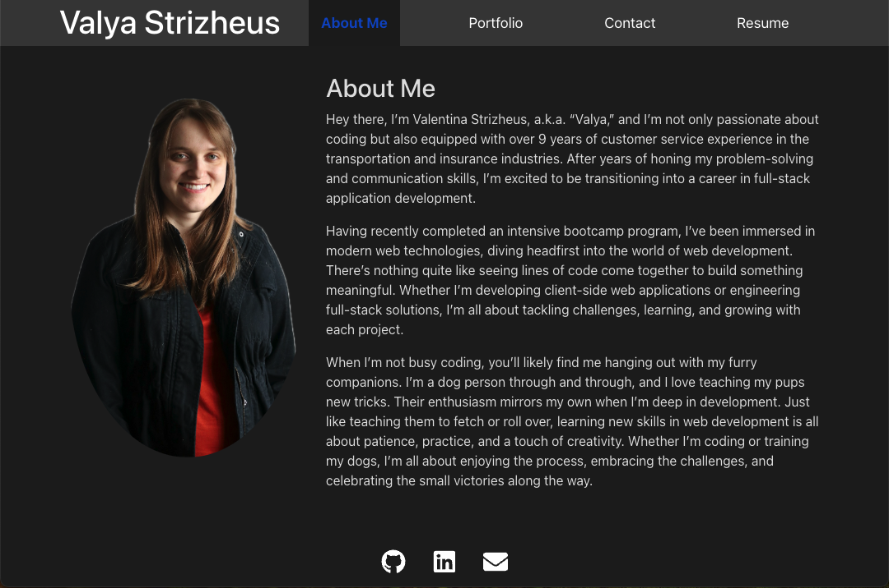

# Valya Strizheus Portfolio

This is my personal portfolio website created using React and Bootstrap. The purpose of this website is to showcase my projects and experience as a web developer. It includes an About Me section, Portfolio, Contact form, and Resume download feature.

## Table of Contents
- [About the Project](#about-the-project)
- [Technologies Used](#technologies-used)
- [Features](#features)
- [Installation](#installation)
- [Usage](#usage)
- [License](#license)
- [Contact](#contact)

## About the Project
This project was created to showcase my work as a developer and provide a professional online presence. The portfolio is built as a single-page React application and deployed using Netlify. It includes several sections:
- **About Me**: A brief introduction to who I am and what I do.
- **Portfolio**: A collection of my projects with links to both the live projects and the source code on GitHub.
- **Contact**: A form to reach out to me directly.
- **Resume**: A downloadable copy of my resume, along with a summary of my experience and skills.



## Technologies Used
- **React**: A JavaScript library for building user interfaces.
- **Bootstrap**: CSS framework for responsive design.
- **React Router**: For navigation between pages.
- **CSS**: For custom styling.

## Features
- Responsive design optimized for both desktop and mobile devices.
- Interactive project cards with links to live demos and GitHub repositories.
- Contact form with validation for proper email input.
- Resume download button.

## Installation
1. Clone the repository:
    ```bash
    git clone https://github.com/valyastriz/Strizheus-Portfolio.git
    ```
2. Navigate to the project folder:
    ```bash
    cd Strizheus-Portfolio
    ```
3. Install the dependencies:
    ```bash
    npm install
    ```
4. Run the application:
    ```bash
    npm run dev
    ```

## Usage
- Visit the live site here: [Portfolio Live Site](https://clever-gnome-da8aaf.netlify.app/).
- To view the source code, check out the GitHub repository: [GitHub Repository](https://github.com/valyastriz/Strizheus-Portfolio.git).

## License
This project is licensed under the MIT License. See the LICENSE file for more details.

## Contact
You can reach me via:
- **GitHub**: [valyastriz](https://github.com/valyastriz)
- **LinkedIn**: [Valentina Strizheus](https://www.linkedin.com/in/valya-strizheus-b9380a2a2)

Feel free to get in touch if you'd like to discuss any potential collaborations or job opportunities!